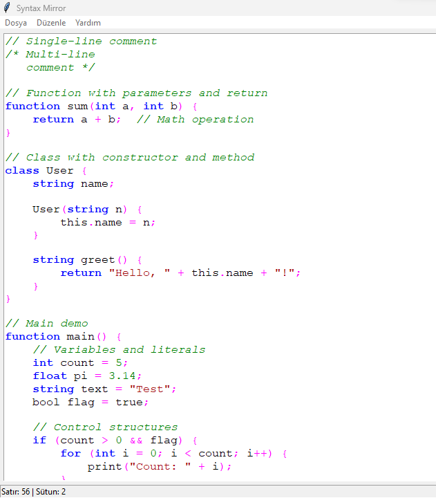

# Syntax Mirror

A real-time syntax highlighter with a graphical user interface that performs lexical analysis and parsing based on formal grammar rules.



## Proje Bağlantıları

- **Demo Video**: [Watch on YouTube](https://www.youtube.com/watch?v=WS_rQJAiQrs)
- **Article**: [Read on Dev.to](https://dev.to/yourusername/real-time-grammar-based-syntax-highlighter-1234) *(Update with your published article link)*
- **Interim Report**: [View PDF](docs/Programming%20Languages%20Project%20-%20Interim%20Report%20Form%20(2).pdf)

## Features

- 7 farklı token türü ile gerçek zamanlı sözdizimi vurgulama
- Durum diyagramı ve tablo güdümlü uygulama kullanan özel sözcüksel analizci
- Yukarıdan aşağıya özyinelemeli iniş ayrıştırıcı uygulaması
- Dosya işlemleri ile modern GUI arayüzü
- Harici sözdizimi vurgulama kütüphaneleri kullanılmamıştır

## Vurgulanan Token Türleri

1. **Anahtar Kelimeler**: Dile özgü rezerve edilmiş kelimeler (if, else, while, vb.)
2. **Operatörler**: Matematiksel ve mantıksal operatörler (+, -, *, /, =, vb.)
3. **Tanımlayıcılar**: Değişken ve fonksiyon adları
4. **Sayılar**: Tamsayı ve kayan noktalı literaller
5. **Diziler**: Tırnak içine alınmış metin
6. **Yorumlar**: Satır ve blok yorumları
7. **Hatalar**: Geçersiz sözdizimi veya tanınmayan tokenler

## Proje Yapısı

```
.
│── src/
│   │── gui/           # GUI uygulaması
│   │   └── editor.py  # Vurgulamalı metin editörü
│   │── lexer/         # Sözcüksel analizci 
│   │   └── lexer.py   # Token tanımı ve çıkarma
│   │── parser/        # Sözdizimi ayrıştırıcısı
│   │   └── parser.py  # Gramer kuralları ve ayrıştırma
│   │── highlighter/   # Sözdizimi vurgulama mantığı
│   │   └── highlighter.py # Vurgulama kuralları ve uygulama
│   └── main.py        # Uygulama giriş noktası
│── tests/             # Test dosyaları
│── docs/              # Dokümantasyon
└── requirements.txt   # Proje bağımlılıkları
```

## Kurulum

1. Depoyu klonlayın
2. Bağımlılıkları yükleyin:
   ```bash
   pip install -r requirements.txt
   ```

## Kullanım

Uygulamayı çalıştırın:
```bash
python -m src.main
```

## Dokümantasyon

Proje dokümantasyonu ve ara rapor için lütfen [Programlama Dilleri Projesi - Ara Rapor Formu (2).pdf](docs/Programlama%20Dilleri%20Projesi%20-%20Ara%20Rapor%20Formu%20(2).pdf) dosyasını inceleyiniz.

## Lisans

MIT Lisansı 